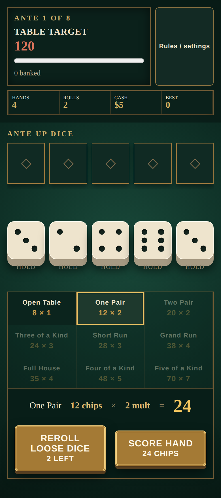

# Ante Up Dice

An original offline-first solo dice-poker roguelike. Roll and hold five dice, score poker patterns, collect deterministic charms, and beat eight escalating tables. It uses only local assets and stores saves on the device.



## Game loop

1. Roll five dice and hold the values you want to keep.
2. Use up to three rolls, then score any valid poker-style category.
3. Beat the ante target before four scoring hands run out.
4. Spend rewards on deterministic charms that reshape future scores.
5. Clear all eight escalating tables to win the run.

## Develop and verify

Requires Node 20+.

```bash
npm install
npm run dev
npm run lint
npm run typecheck
npm test
npm run build
npx playwright install chromium
npm run e2e
```

Vite serves the app at `/ante-up-dice/`, matching GitHub Pages. The production service worker precaches the game for offline play.

## Deploy

Enable Pages with **GitHub Actions** as its source. Pushes to `main` build and publish `dist/` through the included workflow.

See [game design](docs/game-design.md), [architecture](docs/architecture.md), and [backlog](docs/backlog.md).
