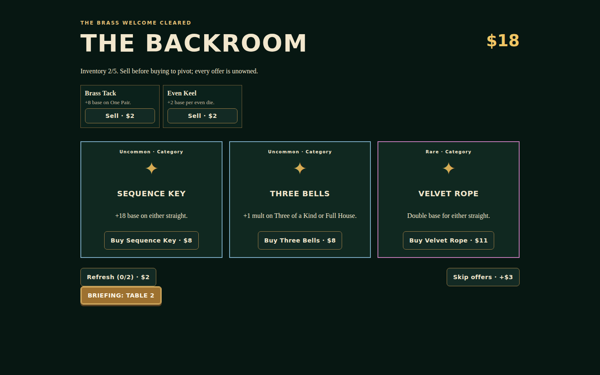
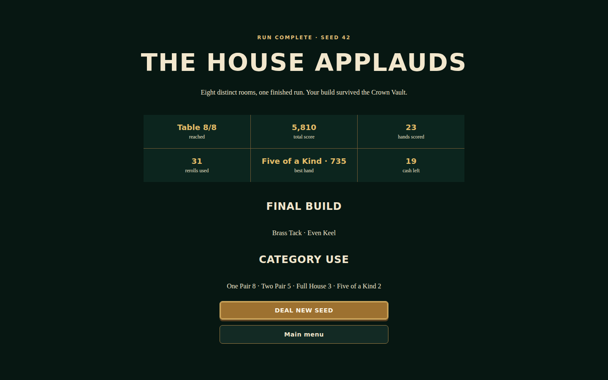

# Ante Up Dice

Ante Up Dice is an original, offline-first solo dice-poker roguelike. Shape five-die hands, adapt to eight named house rules, and assemble a five-charm build from 26 deterministic effects. Every score exposes its arithmetic, and every run is reproducible from its seed.

<p align="center">
  
</p>

| The Backroom | Victory recap |
| --- | --- |
|  |  |

## Play loop

1. Read the table briefing and its house rule.
2. Roll up to three times, holding any dice between rolls.
3. Choose any ready category and inspect category base, dice total, table effect, ordered charm triggers, multiplier, and final score.
4. Reach the target within four scored hands.
5. Buy, sell, refresh twice, or skip offers for cash in the Backroom.
6. Clear the eighth table to win. The recap records seed, reach, hands, rerolls, best hand, total score, build, and category use.

## Develop and verify

Node `^20.19.0` or `>=22.12.0` is required by Vite 8.

```bash
npm install
npm run dev
npm run lint
npm run typecheck
npm test
npm run simulate
npm run build
npx playwright install chromium
npm run e2e
npm audit --audit-level=high
```

`npm run simulate` executes 1,000 seeded runs through the production engine. Vite serves at `/ante-up-dice/`; the production service worker precaches local assets for offline play.

See [game design](docs/game-design.md), [architecture](docs/architecture.md), [balance report](docs/balance.md), [manual QA](docs/manual-qa.md), and [backlog](docs/backlog.md).
